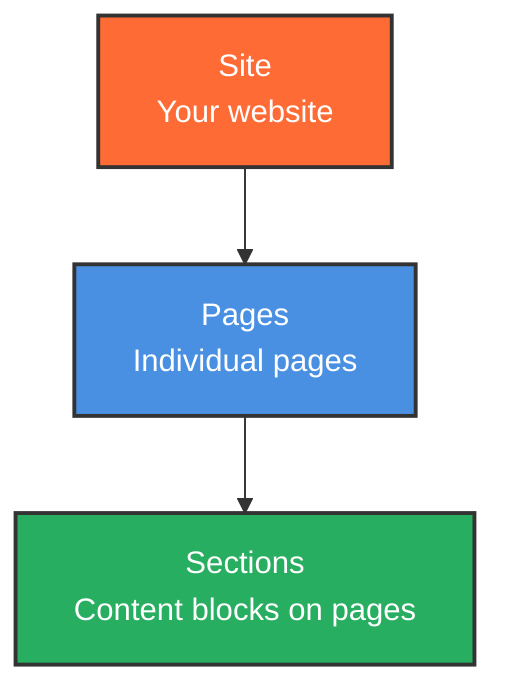
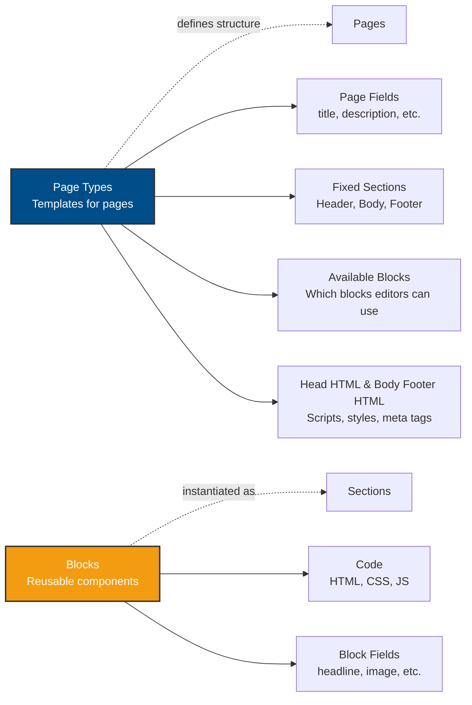
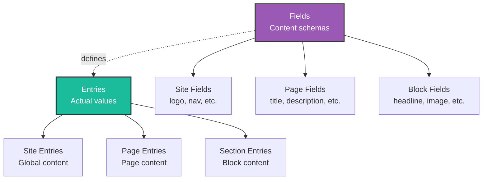

Understanding Pala's core concepts helps you build sites more effectively. Everything in Pala follows a clear hierarchy that separates structure from content, giving you control while empowering editors.

## The Content Hierarchy

Pala organizes content in three levels:

```
Site → Pages → Sections
```

This is your actual content structure - what lives in your database and what gets published.

**Page Types** and **Blocks** aren't part of this hierarchy - they're blueprints that define structure and behavior for pages and sections, respectively.

### Understanding the Structure

Let's break down how everything fits together with three focused diagrams:

**1. Content Hierarchy** - Your actual content structure:



**2. Templates & Structure** - How structure is defined:



**3. Data Model** - How content is stored:



<Info>
**Key concepts:** **Blocks** are self-contained full-width components written in Svelte. They define a content schema using fields and are instantiated as sections when added to pages. **Page Types** define which blocks can be used, fixed sections (header/body/footer), and page-level fields. **Fields** define data schemas, **Entries** store the actual values.
</Info>

## Sites

A **site** is your top-level container. Each site is completely independent with its own:

- **Site-wide content** - Navigation menus, logo, footer content, social links
- **Design system** - CSS variables for colors, typography, spacing
- **Page types** - Templates that define page structure
- **Site-specific blocks** - Blocks available only to this site
- **Domain** - Each site is tied to a specific hostname

When you create a new site, you choose a starter:
- Pick one of your existing sites as a template
- Choose a starter from the marketplace (blog, portfolio, restaurant, etc.)
- Start with a blank starter to build from scratch

## Page Types

**Page types** are templates that define the structure and capabilities of pages. To create one, you simply give it a name, icon, and color. Then you configure:

- **Page fields** - Content like title, description, publish date, or relational fields (e.g. author, location, etc.)
- **Available blocks** - Which blocks editors can add to pages
- **Fixed sections** - Static header/body/footer sections that appear on every page of this type (also called "Static page types" in the UI when body sections are fixed)

### Example Page Type Uses

Page types are completely customizable. Here are common examples:

**Content Types:**
- **Blog Post** - For individual blog articles
- **Person** - For team member profiles
- **Event** - For event listings
- **Case Study** - For portfolio pieces
- **Location** - For store/office locations
- **Product** - For e-commerce items
- **Documentation** - For help articles

**Layout Types:**
- **Blank** - No fixed sections, all blocks available
- **Standard** - Header/footer with standard blocks
- **Editorial** - Reading-focused layout with limited blocks

Everything in Pala is a page. Whether it's a content entity (blog post, team member) or a flexible layout page (homepage, about page), so long as it has a common structure you create a page type for it.

<Accordion title="Example: Blog Post Page Type">
A "Blog Post" page type might include:
- **Fixed header sections** - Site navigation (static content across all blog posts) + page header (pulls title from page field) 
- **Page fields**: Title, Description, Author, Publish Date, Featured Image
- **Available blocks**: Hero, Text, Image, Code Block, Call-to-Action, Video
- **Fixed footer sections** - Newsletter signup form (static content across all blog posts) + site footer

Blocks unavailable might include those specific to other page types, like "Person Bio" blocks that depend on "Person" page fields.
</Accordion>

### About Fixed Sections

Fixed sections (ie sections within the header/footer slots) contain static content that stays the same across all pages of that type. If you want dynamic content in a fixed section (like showing the page title), you should connect it to a page field:

```svelte
<!-- In your header block -->
<h1>{title}</h1>  <!-- connects to page field -->
```

### Block Availability

Pala doesn't differentiate between types of blocks - you control which blocks are available per page type. For one-time-use blocks (like a homepage hero), toggle it on, place it on the page, then toggle it off. Toggling it off doesn't remove it from existing pages, just prevents editors from adding it again.

**Cross-page type dependencies:** When a block references fields from a different page type, Pala shows a broken link icon with "References Page Fields from [Page Type]". You can still add the block, but those fields won't have data. To use a block across multiple page types, give each field the same key (e.g., a header block with `title` fields connected to both "Blank" and "Standard" page types, both referenced as `{title}` in the code).

## Pages

**Pages** are instances of page types. In Pala, everything is a page - whether it's content (blog post, team member) or layout (homepage, about page).

### Creating Pages

To create a page:

1. **Open the page list** - Click "Pages" in the toolbar
2. **Choose creation method:**
   - Click "Create Page" for a top-level page
   - Click "Create Subpage" next to a page to create a child page (or click the three-dot menu on a child-less page)
3. **Configure the page:**
   - **Name** - Internal identifier (or external if using `_meta.name`)
   - **Slug** - URL path segment
   - **Page Type** - Template to use (hidden if only one exists)
4. **Add content:**
   - Fill out page fields
   - Add sections from available blocks (or edit existing default sections)
   - Fixed sections (if any) are already in place and can't be removed
5. **Publish when ready**

Pages are built by stacking sections vertically. Each page follows the structure defined by its page type, ensuring consistency while allowing flexibility in content and layout.

## Blocks

**Blocks** are self-contained full-width components written in Svelte. They define a content schema using fields and are instantiated as sections when added to pages.

### Two Types of Blocks

**Library Blocks:**
- Stored in your server library
- Reusable across all your sites
- Build once, use everywhere

**Site-Specific Blocks:**
- Available only to one site
- Useful for site-specific components
- Don't clutter your server library

### Block Structure

Each block contains:
- **Component code** - Svelte component with HTML, CSS, and JavaScript
- **Content fields** - Editable data that editors can modify
- **Field configuration** - Define what content can be edited and how

Blocks stack vertically to create page layouts through sections (instances of blocks with actual content).

## Sections

**Sections** are instances of blocks placed on pages. When you add a block to a page, you're actually creating a section - an instance of that block with its own content.

Think of it this way:
- **Block** = template/blueprint (the code and schema)
- **Section** = instance (the actual content on a page)

<Accordion title="Example: Blocks vs Sections">
You have a "Hero" block in your library. When editors add it to the homepage, they create a section. That section has its own content (headline, image, etc.) separate from other Hero sections on different pages.
</Accordion>

This separation allows:
- The same block to be used multiple times with different content
- Block code updates to apply to all sections using that block
- Each section to maintain its own content independently

## The Collaboration Model

This hierarchy enables a powerful collaboration model:

**Developer Role:**
- Define page types with available blocks
- Set required blocks and constraints
- Build and style components
- Configure content fields

**Editor Role:**
- Create pages from page types
- Add and arrange sections from blocks
- Edit content within fields
- Publish when ready

**Result:** Developers control structure and design. Editors control content and layout. Both work independently without breaking each other's work.

<Info>
Editors cannot modify page types, edit component code, or change design settings (unless pre-configured, like block variations). They work within the guardrails you define, ensuring designs stay intact while content remains flexible.
</Info>

## Putting It Together

Here's how it all works in practice:

1. **You create a site** and choose a starter
2. **You define page types** like "Blog Post" with available blocks and fixed sections
3. **You build blocks** (Hero, Text, Image) and add them to your library
4. **Editors create pages** using the "Blog Post" page type
5. **Editors add sections** (instances of blocks) from the available options
6. **Editors edit content** within each section's fields
7. **Editors publish** when ready
8. **Repeat** from step 2 as required or desired

The hierarchy ensures consistency while maintaining flexibility. Every page follows its page type's structure, but editors have full control over which sections to add and what content to include.

## Next Steps

<CardGroup cols={2}>
	<Card title="Quickstart" icon="bolt" href="/getting-started/quickstart">
		Build your first site and see these concepts in action.
	</Card>
	<Card title="Your First Site" icon="rocket" href="/building-sites/your-first-site">
		Step-by-step guide to creating a complete site.
	</Card>
	<Card title="Architecture" icon="cube" href="/reference/architecture">
		Learn how Pala works under the hood.
	</Card>
	<Card title="Defining Page Types" icon="layer-group" href="/building-sites/defining-page-types">
		Set up page types to control structure and available blocks.
	</Card>
</CardGroup>
