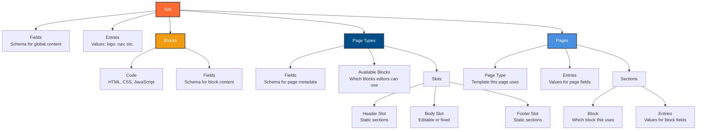

Understanding Pala's core concepts helps you build sites more effectively. Everything in Pala follows a clear hierarchy that separates structure from content, giving you control while empowering editors.

## The Hierarchy

Pala organizes content in a simple, predictable structure:

```
Site → Page Types → Pages → Blocks → (optional) Sections
```

Each level builds on the previous one, creating guardrails that keep designs intact while giving editors the freedom to manage content.

### Architecture Diagram

Here's how the data model works:



<Info>
**Terminology:** **Fields** define schemas, **Entries** store values. **Blocks** (called Symbols in code) are reusable components with code and field definitions. **Sections** are block instances on pages with their own entries.
</Info>

## Sites

A **site** is your top-level container. Each site is completely independent with its own:

- **Site-wide content** - Navigation menus, logo, footer content, social links
- **Design system** - CSS variables for colors, typography, spacing
- **Component library** - Your personal collection of reusable blocks
- **Settings** - Domain configuration, SEO defaults, and more

<Info>
You can create multiple sites in Pala. Each site operates independently, so you can manage multiple client projects or separate staging/production environments.
</Info>

When you create a new site, you start with a blank canvas. You'll define page types, build blocks, and configure settings to match your project's needs.

## Page Types

**Page types** are templates that define what kind of pages can exist in your site. Think of them as blueprints that control:

- **Structure** - Which blocks are available for editors to use
- **Required blocks** - Blocks that always appear (like headers or footers)
- **Page-level fields** - Metadata like title, description, publish date
- **Constraints** - What editors can and cannot modify

Common page types include:
- Blog posts
- Landing pages
- Team member profiles
- Event listings
- Product pages

<Example>
A "Blog Post" page type might include:
- Required Header block at the top
- Available blocks: Hero, Text, Image, Code Block, Call-to-Action
- Page fields: Title, Author, Publish Date, Category, Featured Image
- Not available: Footer blocks (reserved for site-wide footer)
</Example>

Page types act as guardrails. Editors can create pages and choose which blocks to use, but they can't modify the page type itself or use blocks you haven't made available.

## Pages

**Pages** are instances of page types with actual content. Editors create pages by:

1. Choosing a page type
2. Adding blocks from the available options
3. Filling in content fields
4. Publishing when ready

Pages are built by stacking blocks vertically. Each page follows the structure defined by its page type, ensuring consistency while allowing flexibility in content and layout.

<Info>
Pages can be published, saved as drafts, or scheduled for future publication. You control the publishing workflow through page type settings.
</Info>

## Blocks

**Blocks** are the building blocks of your pages. They're Svelte components with content fields attached, making them both code and content.

### Components vs Blocks

**Components** are pure Svelte code:
- Reusable UI elements (Button, Card, Hero)
- Accept props and handle logic
- No content fields attached
- Can be used anywhere in your Svelte code

**Blocks** are components with content fields:
- Same Svelte component code
- Plus editable content fields (text, images, links)
- Used specifically in page types and pages
- Editors can modify content, not code

<Example>
You build a Hero component in Svelte with props for `headline`, `subheadline`, and `cta_text`. Then you attach content fields to it, creating a Hero block. Editors can now use this block and edit the headline, subheadline, and CTA text without touching any code.
</Example>

Blocks stack vertically to create page layouts. You build them once, add them to your component library, and reuse them across pages and sites.

### Block Structure

Each block contains:
- **Component code** - Svelte component with styling and logic
- **Content fields** - Editable data (text, images, colors, etc.)
- **Options** - Configurable settings editors can toggle

<Info>
Blocks live in your component library. Once created, they're available across all your sites, making it easy to build a personal library of your best work.
</Info>

## Sections (Optional)

**Sections** are horizontal containers within blocks. They help organize complex layouts when a single block needs multiple columns or complex arrangements.

Use sections when you need:
- Multi-column layouts within a block
- Complex grid arrangements
- Side-by-side content areas
- Nested content structures

<Example>
A "Features" block might use sections to create a three-column layout, with each section containing an icon, headline, and description. The block defines the overall styling, while sections organize the horizontal arrangement.
</Example>

Most blocks don't need sections. Use them when a block's layout becomes complex enough to benefit from horizontal organization.

## The Collaboration Model

This hierarchy enables a powerful collaboration model:

**Developer Phase:**
- Define page types with available blocks
- Set required blocks and constraints
- Build and style components
- Configure content fields

**Editor Phase:**
- Create pages from page types
- Add and arrange blocks
- Edit content within fields
- Publish when ready

**Result:** Developers control structure and design. Editors control content and layout. Both work independently without breaking each other's work.

<Warning>
Editors cannot modify page types, edit component code, or change design settings. They work within the guardrails you define, ensuring designs stay intact while content remains flexible.
</Warning>

## Putting It Together

Here's how it all works in practice:

1. **You create a site** and configure site-wide settings
2. **You define page types** like "Blog Post" with available blocks
3. **You build blocks** (Hero, Text, Image) and add them to your library
4. **Editors create pages** using the "Blog Post" page type
5. **Editors add blocks** from the available options
6. **Editors edit content** within each block's fields
7. **Editors publish** when ready

The hierarchy ensures consistency while maintaining flexibility. Every page follows its page type's structure, but editors have full control over which blocks to use and what content to include.

## Next Steps

<CardGroup cols={2}>
	<Card title="Quickstart" icon="bolt" href="/getting-started/quickstart">
		Build your first site and see these concepts in action
	</Card>
	<Card title="Your First Site" icon="rocket" href="/building-sites/your-first-site">
		Step-by-step guide to creating a complete site
	</Card>
</CardGroup>
